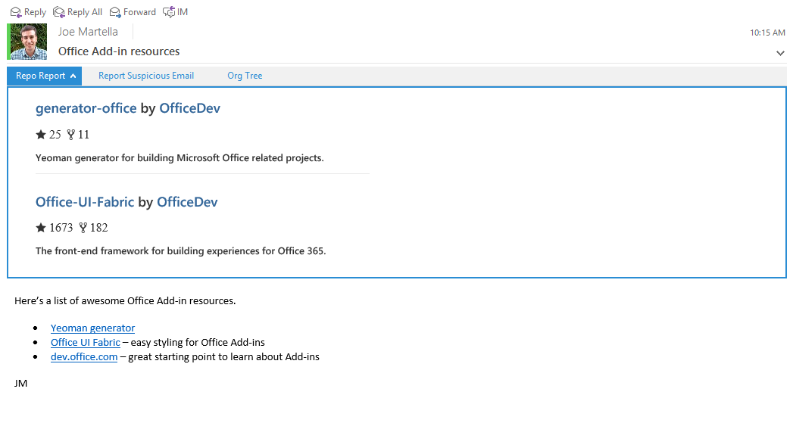

# Repo Report
**Repo Report** is an Outlook add-in, made with Angular, that scans your emails for public GitHub repository links and displays information about the ones it finds.

## Prerequisites
* [npm](https://www.npmjs.com/), Node Package Manager, is required to install dev dependencies.
* [Bower](http://bower.io/) is required to install frontend dependencies. 
* [Gulp](http://gulpjs.com/) is used as a task runner, including serving the application on a development server.
* An Office 365 account. If you don't have one, you can [join the Office 365 Developer Program and get a free 1 year subscription to Office 365](https://aka.ms/devprogramsignup).

## Configure the add-in
1. Clone this repository.
2. Run `npm install` to install both npm and Bower dependencies.
3. Run `gulp serve-static` to start development server.
4. Go to [mail.office365.com](http://mail.office365.com) and sign in with your Office 365 account.
5. Click the gear icon on the upper right, then choose *Manage add-ins*.
6. Click the plus icon, then choose *Add from a file*.
7. Browse to this repository folder and choose *manifest.xml*.
8. Then complete the wizard (*Next*, *Install*, *OK*) to make the add-in available on your Office 365 account.
9. Finally, you'll have to open the [app](https://localhost:8443/appread/index.html) in a browser and trust the certificate for `localhost:8443`. The add-in won't run if your computer doesn't trust it.

## Run the add-in
1. After installing the add-in, go to [mail.office365.com](mail.office365.com). 
2. Choose an email (you probably have to send yourself one first) that has at least one link to a public GitHub repository. *The add-in is only activated if a target URL is found!*
3. Click *Repo Report* found directly above the body of the email to see the add-in in action.

## Questions and comments
We'd love to get your feedback about this sample. You can send your questions and suggestions to us in the [Issues](https://github.com/OfficeDev/Outlook-Add-in-RepoReport/issues) section of this repository.

## Additional resources
* [Yeoman generator](https://github.com/OfficeDev/generator-office) - Yeoman generator for building Microsoft Office related projects (including add-ins). This project was built using it.
* [Office UI Fabric](https://github.com/OfficeDev/Office-UI-Fabric/) - The front-end framework for building experiences for Office 365. This project uses it to get an Office "look and feel". 
* [dev.office.com](http://dev.office.com) - Find documentation, samples, and other helpful information relevant to Office development.
* [Regular expression activation](https://msdn.microsoft.com/en-us/library/office/fp142135.aspx) - To get add-ins to activate on a specific URL format, we used regular expressions.

## Copyright
Copyright (c) 2015 Microsoft. All rights reserved.

This project has adopted the [Microsoft Open Source Code of Conduct](https://opensource.microsoft.com/codeofconduct/). For more information, see the [Code of Conduct FAQ](https://opensource.microsoft.com/codeofconduct/faq/) or contact [opencode@microsoft.com](mailto:opencode@microsoft.com) with any additional questions or comments.
